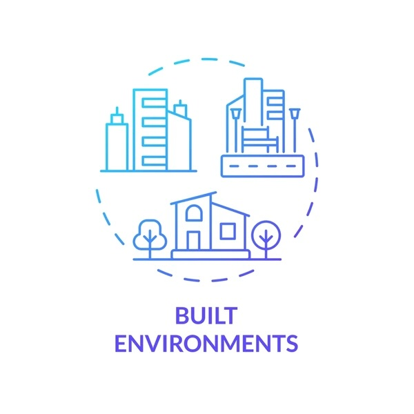

<!-- title -->

<!--lint ignore no-dead-urls-->

# Built Environment Open Data  

<!-- subtitle -->

A list of open data sources relating to the built environment.

<!-- image -->

<!-- description -->

This is a resource page for compiling links to all the openly available built environment-related datasets I can find. It is primarily intended for teaching purposes, to make finding data examples easier, however researchers may also find it useful.

The page is organised by general field or focus of the dataset. 

At this stage, each data source should be included with its name, a link (preferably a doi link), a brief description, and the citation. As this project matures, the plan is to add [datacards](https://research.google/blog/the-data-cards-playbook-a-toolkit-for-transparency-in-dataset-documentation/) for new datasets.

<!-- TOC -->

## Contents

- [General Data Repositories](#general-data-repositories)
- [Industry and Market](#industry-and-market)
- [Follow](#follow)

<!-- CONTENT -->

## General Data Repositories

Good places to start when looking for datasets.

- [UK Data Service](https://ukdataservice.ac.uk/find-data/browse/)

## Industry and Market

Data relating to the construction industry, i.e. market/economic data, management surveys, technology adoption rates, etc.

### Project Management

- [Project Portfolio Dataset](https://figshare.com/articles/dataset/Project_Portfolio_Dataset/12998822?file=24779909) - Thiele, Brett; Ryan, Michael; Abbasi, Alireza (2020). "Project Portfolio Dataset". figshare. Dataset. doi: 10.6084/m9.figshare.12998822.v3

### Economic

- [Identifying the Critical Success Factors of PPP Projects in China](https://10.17632/3ygsn7pcyp.1) - Dai, Zheng; LYU, SHOUJUN (2018), “Identifying the Critical Success Factors of PPP Projects in China ”, Mendeley Data, V1, doi: 10.17632/3ygsn7pcyp.1.

### Artificial Intelligence

- [Trust in AI for production management - Survey](http://10.17632/pg8hnttzkm.2) - Saßmannshausen, Till (2020), “Data from an online survey on initial trust in artificial intelligence for production management tasks”, Mendeley Data, V2, doi: 10.17632/pg8hnttzkm.2.

### Building Information Modelling (BIM)

- [Use of BIM in projects in Lima City](http://doi.org/10.17632/8n2ymkttkp.5) - Tapia Nieto, Gerson; Collantes, Junior (2020), “Use of Building Information Modeling (BIM) technology in urban building projects in Lima city and Callao 2017, Dataset”, Mendeley Data, V5, doi: 10.17632/8n2ymkttkp.5.
- [Management surveys on knowledge management (KM), core competence (CC), and firm competitiveness (FC) in South Asia](https://dx.doi.org/10.5255/UKDA-SN-855898) - Fatima, Iram and Aziz, Iffat and Shafiq, Muhammad (2024). Impact of Knowledge Management on Firm Competitiveness: Core Competence as Mediator, 2020-2021. (Data Collection). Colchester, Essex: UK Data Service. 10.5255/UKDA-SN-855898.

<!-- END CONTENT -->

## Follow

<!-- list people worth following on social sites (Twitter, LinkedIn, GitHub, YouTube etc.) -->

Who else should we be following!?

## Contributing

[Contributions of any kind welcome, just follow the guidelines](contributing.md)!

### Contributors

[Thanks goes to these contributors](https://github.com/MitchellAcoustics/open-built-env-data/graphs/contributors)!
